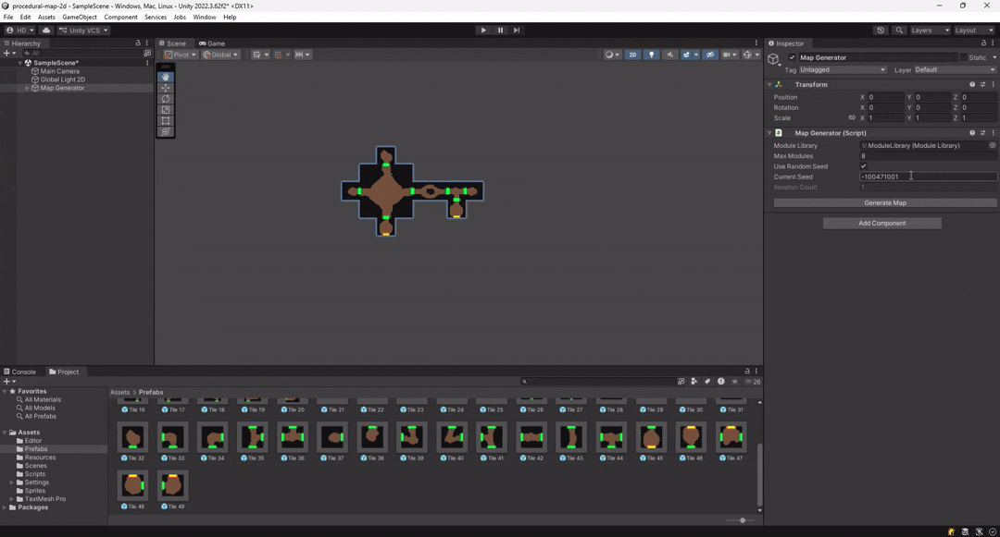

# Generación procedural de mapas 2D

Este sistema construye mapas conectando módulos con puertas de forma válida, garantizando conectividad total, una entrada y una salida, y sin puertas abiertas.

  

## Creación y configuración de módulos

Los módulos son **Prefabs** configurables desde el editor. Cada módulo debe contener:

1. Un objeto raíz con un *SpriteRenderer* y el componente `Module.cs`.
2. Tantos objetos hijos como puertas tenga el sprite, colocados en su posición correspondiente y con el componente `Door.cs`.

Para agilizar la creación, `Module.cs` incluye un botón en el inspector que configura automáticamente las variables serializadas (collider, lista de puertas y orientación de cada puerta).

El sistema **no detecta automáticamente qué puertas son de entrada o salida**, por lo que estas deben marcarse manualmente desde el inspector.

  

## Sistema de seed

El sistema permite usar una **seed reproducible**, generando con el mismo valor exactamente el mismo mapa.

  

## Cómo generar un mapa

1. Abrir la escena `SampleScene`.
2. Seleccionar el GameObject `MapGenerator`.
3. Ajustar los parámetros desde el Inspector.
4. Pulsar **Generate Map**.

Cada generación limpia el mapa anterior antes de crear uno nuevo.

## Parámetros configurables

Desde el componente **MapGenerator**:

- **Module Library** (`ScriptableObject`): Librería con todos los módulos que el algoritmo puede usar para generar el mapa.
- **Max Modules** (`int`): Número máximo de módulos a generar.
- **Use Random Seed**  (`bool`): Si está activado, el mapa se genera de forma aleatoria.
- **Seed**  (`int`): Si **Use Random Seed** está desactivado, este valor se usará como semilla para la generación del mapa.
- **Current Seed**  (`int`): Valor de la semilla utilizado en la generación actual. Está público para que se pueda copiar fácilmente.

## Flujo general del algoritmo

1. Se instancia un módulo inicial (Entrada).
2. Se conectan las puertas no conectadas con nuevos módulos.
3. Para cada puerta:
   - Se buscan módulos candidatos que tengan puertas compatibles con la orientación de la puerta no conectada.
   - Se elige un candidato al azar.
   - Se comprueba que el candidato cumpla los siguientes requisitos:
     - No colisionar con otros módulos ya generados.
     - No bloquear la expansión futura del mapa.
     - Que el número de puertas que genera no obligue a superar el máximo de módulos permitido.
     - Que no bloquee otras puertas ya creadas para poder conectarse.
   - Si el candidato no cumple alguno de estos requisitos, se elige otro candidato.
4. Se repite el paso 2 hasta alcanzar el numero máximo de módulos.

## Uso de IA

Se ha utilizado **IA (ChatGPT)** como apoyo para:
- Simplificación de código
- Herramientas de editor
- Documentación
